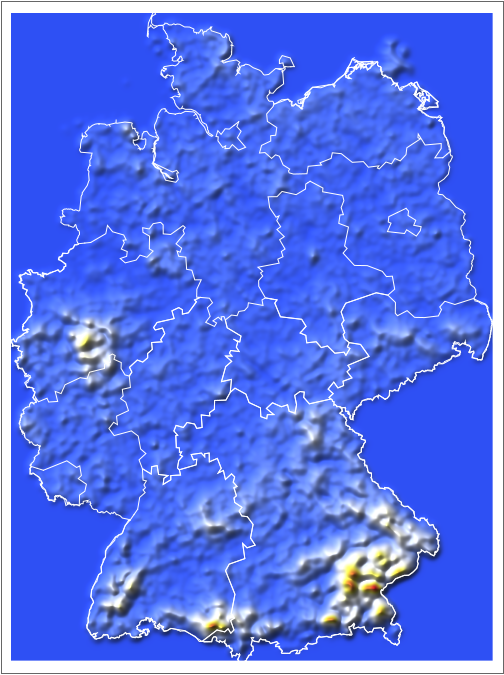
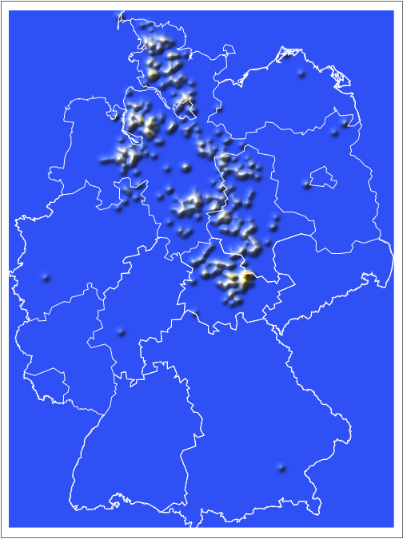

## Intro

I don't remember when or why, but at some point I asked myself "I wonder to what extent it is possible to know in which part of Germany you are, based only on the characteristics of nearby place names." Even just looking at a map, or traveling around Germany a bit, some rough patterns are pretty apparent: In Baden-Württemberg there are many cities ending in "-ingen" (Böblingen, Villingen-Schwenningen). In Berlin and Brandenburg you'll find places ending in "-ow" (Pankow, Rathenow). Other substrings, such as "dorf" (village), "burg" (castle) or "berg" (hill/mountain) are seemingly ubiquitous and not unique to a region.

Well, I've now gone ahead and created some relief maps for the density of places whose names contain certain substrings. They contain interesting insight into linguistic and geographic differences within Germany. Also, if you want to create a fictional German town, this data can give you an idea of what its name should be, based on where in Germany it is located!

## Methods

I downloaded OpenStreetMap data for Germany from Geofabrik and used a modified version of [lifeeth's osmnodepbf scripts](https://github.com/lifeeth/osmnodepbf) to extract the names and coordinates for all settlements. The extracted data can be found at [data/](data/). For the country and state borders I used data from Wolfram/Mathematica.

To estimate densities I calculated histograms and smoothed them with a Gaussian filter. To minimize biases due to different regions having different densities of named settlements I always normalized with the estimated prior density as shown below, which includes all places. For visualization I used Mathematica's builtin ReliefMap function. Due to the normalization in ReliefMap the height values from separate map images cannot be compared directly.

I haven't looked into why some areas have a much higher density of named places than other areas, but there is no obvious connection to population density. I suspect that it is either due to some data sets which were made freely available, or because of volunteers for openstreetmap being more active in those areas for whatever reasons.

A piece of border between Lower Saxony and Brandenburg is missing, because the data from Wolfram was in a stupid format and I couldn't be bothered to fix it.

Here is a collection of some of the more interesting results, more can be found at [pics/](pics/).

#### Some of the most common substrings

berg (hill/mountain)  
  

dorf (village)  
  

haus (house)  
  

hof (farm)  
  

mühl (mill)  
  

#### Variations on bach (brook/stream)

bach  

beck  

bek  

#### Variations on stadt (city, but originally, and depending on spelling, also place)

stadt  
  

städt  
  

stätt  
  

stedt  
  

stett  
  

#### Various river and region names

allgäu  
  

harz  

pfalz (palatinate)  
  

donau (Danube)  
  

neckar  
  

rhein (Rhine)  
  

ruhr  
  

#### Cardinal directions

nord (north)  
  

süd (south)  
  

west  
  

ost (east)  
  

#### Relative positions

ober (upper)  
  

mitte (middle)  
  

unter (lower)  
  

vorder (front)  
  

hinter (behind)  
  

#### Variations on brunn (well or source)

brunn  
  

bronn  
  

born  
  

#### tal and thal (valley)

tal  
  

thal  
  

#### Various, which all mean clearing

rath  
  

scheid  

rode  
  

#### Others

burg (castle)  
  

by (farm in northern Germany, in other parts (river) curve)
  

hagen (enclosure)  
  

heide (heath/heathen)  
  

heim (home)  
  

leben (legacy/heritage)  
  

torf (peat)  

weiler (hamlet)  

ing  
  

ingen  
  

itz  
  

oi  
  

ow  
  

tzsch  
  
